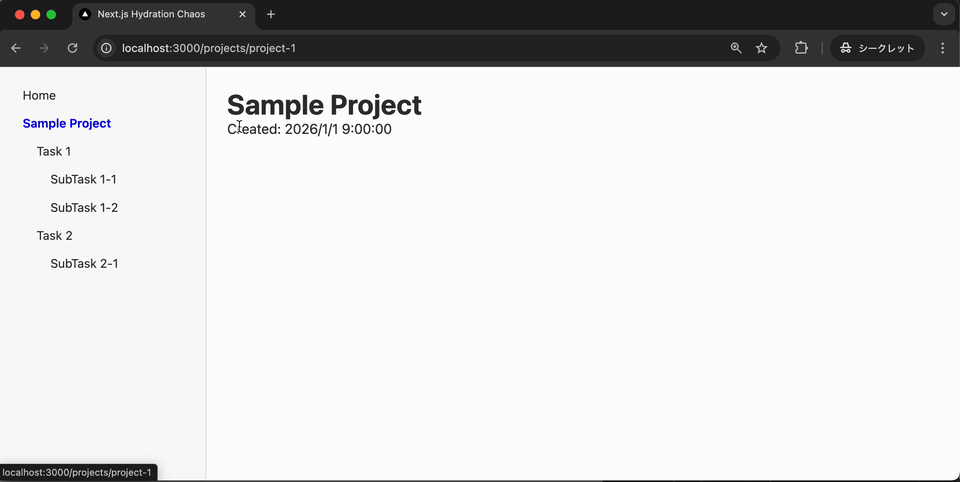

# Next.js Hydration Chaos

Next.js 14 (App Router) で Hydration Error と依存パッケージ内の CSS import が組み合わさると、クライアントサイドナビゲーションが壊れるバグの最小再現リポジトリ。



## Quick Start

```sh
npm install
sh scripts/start_chaos.sh        # TZ=UTC0 でサーバー起動
# or
sh scripts/start_chaos_docker.sh  # Docker版
```

### 再現手順

1. http://localhost:3000/projects/project-1 を直接開く（または Task 画面を開く）→ `toLocaleString` による Hydration Error が発生する
2. サイドナビの任意の SubTask をクリック → 遷移できない

### 再現しない手順

1. http://localhost:3000 (Home) を直接開く（`toLocaleString` を含まないため Hydration Error は発生しない）
2. サイドナビの任意の SubTask をクリック → 遷移できる

## バグの詳細

1. Project / Task 画面を最初に開くと Hydration Error が発生する
2. Hydration Error が遠因となり、SubTask 画面で依存パッケージの CSS import が失敗する
3. Error Boundary が `error.tsx` へのフォールバックを試みる
4. `error.tsx` が使う `Page` コンポーネントが内部で `Button` に依存しており、CSS import で再度失敗する
5. SubTask 画面への遷移がさわやかに失敗する

## 修正方法

- 方法1: クライアントの timezone を Cookie に保存し、サーバー側の `toLocaleString` でそれを使うことで Hydration Error を解消する ([fix-hydration-error](https://github.com/123ishibashi/next-v14-hydration-chaos/tree/fix-hydration-error) ブランチ / [差分](https://github.com/123ishibashi/next-v14-hydration-chaos/compare/main...fix-hydration-error))
- 方法2: Next.js を v16 にアップグレードする ([next-js-16](https://github.com/123ishibashi/next-v14-hydration-chaos/tree/next-js-16) ブランチ / [差分](https://github.com/123ishibashi/next-v14-hydration-chaos/compare/main...next-js-16))
